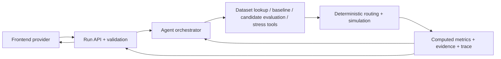

# Simulation integration: implemented vs planned

## Endpoints that exist

Verified against the running FastAPI app on 2026-10-04:

| Route | Current behavior |
| --- | --- |
| `GET /api/` | Health: `{"status":"ok"}` |
| `GET /api/docs` | Swagger UI |
| `GET /api/openapi.json` | OpenAPI; only `/api/` is an application operation |
| `GET /redoc` | FastAPI's default alternate documentation |
| `GET /docs/oauth2-redirect` | FastAPI's default documentation helper |

There are **no civic analysis, agent, routing or simulation HTTP endpoints yet**. The UI is served separately on port 5173. All civic operations use `createMockProviders()` directly in the browser. The basemap uses external tile/style requests; civic fixtures do not.

The transport remains an adapter choice. The team's [API contracts](team/API_CONTRACTS.md) now specify the following **planned** REST boundary; none of these routes is registered yet. Keep that document as the wire-contract source rather than maintaining a competing API schema here.

| Frontend capability | Planned team REST operation |
| --- | --- |
| Capability/source inventory | `GET /api/status`, `GET /api/sources` |
| Communities | `GET /api/communities`, `GET /api/communities/{id}` |
| Services / display transit | `GET /api/services`, `GET /api/transport` |
| Submit objective | `POST /api/objectives/analyse` |
| Retrieve run / map results | `GET /api/runs/{run_id}`, `GET /api/runs/{run_id}/geojson` |
| Generate interventions / contingency | `POST /api/interventions/generate` |
| Simulate | `POST /api/simulations/run` |
| Stress test | `POST /api/stress-tests/run`; `GET /api/stress-scenarios` |
| Accessibility / journeys / investigation | Read from the selected run snapshot |
| Digital twin | Keep local schematic provider; initial backend slice has no site endpoint |

The planned long-running operations return a queued run ID and use polling initially. SSE is a later extension, not a present endpoint. The adapter turns validated wire DTOs/events into the current domain models. Request tracing/idempotency/cancellation belong to the application/transport; database documents and model SDK objects do not enter React.

## Models and ownership

Frontend presentation contracts: `src/frontend/domain/models/index.ts`. Provider contracts: `src/frontend/domain/contracts/providers.ts`. Agent/simulation input envelope: `src/frontend/domain/models/simulation.ts`.

| Group | Models / purpose |
| --- | --- |
| Goal and population | `CivicObjective`, `Community`, `PopulationProfile`: goal, geography and population summaries |
| Network and journey | `ServiceLocation`, `TransportNetwork`, `TransitRoute`, `TransitStop`, `TransitEdge`, `TransportSource`, `Journey`, `JourneyLeg`: services, display network and example trip |
| Findings | `AccessibilityResult`, `FailureReason`, `Investigation`: baseline failure and explanation |
| Credibility | `Evidence`, `DataSource`: source/dataset/freshness/confidence/verification and synthetic labeling |
| Planning | `Intervention`, `InterventionImpact`, `SpatialFeature`: proposed change, preview impacts and map geometry |
| Evaluation | `StressScenario`, `SimulationRun`: disruption and before/after result |
| Physical site | `InfrastructureObservation`, `SpatialAnnotation`, `SiteAudit`, `DigitalTwinAsset`: observations independent of rendering engine |
| Input snapshot | `SimulationContext`, `SimulationRequest`: goal + baseline + scoped data + provenance + candidate + optional disruption |

`backend/domain/models.py` defines separate Pydantic wire contracts under development. They use snake_case and stricter analytical semantics. They are not a running simulator. Preserve that distinction: a backend proposal has executable changes and no invented impact; backend metrics belong to the computed `SimulationRun`. Frontend candidate impact is optional; a missing impact renders as unscored. Existing fixture impact is only a synthetic preview. A real adapter must map these deliberately, not simply rename keys or copy predicted preview metrics into computed results.

Important current model limits:

- `PopulationProfile.aged65Plus` and `.withoutCar` are marginal display counts. They do **not** establish the joint target-cohort denominator. `affectedResidents` in the fixtures is illustrative and cannot be reconstructed from those marginals.
- Frontend journey clocks such as `07:18` are a storyboard, not dated GTFS service times. Real journeys need service date, timezone, departures, calendars and transfer constraints.
- Connected display topology now preserves stop order and edge paths from captured GTFS shapes. It is not a dated routing graph; service calendars, stop times, transfer rules and pedestrian links remain missing. Route geometry alone is not a routable graph. A displayed proposed line does not specify an executable timetable or vehicle operation.
- Frontend stress losses are preset fixture percentage points. Fixture flood/road scenarios now reference `blockedEdgeIds` on the display network, and the Borrisoleigh contingency uses a disjoint captured path. No engine computes these losses or checks road closure feasibility. Real stress changes must identify canonical graph edges/services/trips, then recompute accessibility.
- `mock: true` remains authoritative for the current replay, including a run whose frontend status is named `verified`. That status does not certify public data or real analytical validity.

## Context passed today

The application builds a new deep-copied request before simulation, stress and contingency evaluation. `RequestContext` still contains only `AbortSignal` and `operationId`; it is cancellation/tracing, **not the agent's reasoning context**.

```ts
interface SimulationRequest {
  context: {
    schemaVersion: 1;
    objective: CivicObjective;
    community: Community;
    baseline: AccessibilityResult;
    services: ServiceLocation[];
    transit: TransportNetwork; // routes, ordered stops, connected edges, geometry sources
    journey?: Journey;
    investigation?: Investigation;
    observations: InfrastructureObservation[];
    evidence: Evidence[];
    sources: DataSource[];
    missingInputs: string[];
    reproducibility: {
      snapshotId: string;
      engineVersion: string;
      seed: number;
      timezone: string;
    };
    mock: boolean;
  };
  intervention: Intervention;
  scenario?: StressScenario;
}
```

The builder is intentionally scoped to the synthetic workspace and rejects real/mixed analytical sources. Public geometry provenance lives separately in `transit.sources`; it never certifies synthetic clocks or impact. It deduplicates evidence and sources, excludes another community's journey/investigation/site, and rejects missing goal/community/baseline or cross-region objectives. It includes only already inspected optional details; inspection is not required to simulate the mock. A validated real snapshot adapter will replace this builder's fixture assumptions. Do not expand a browser payload into a whole national dataset.

After a successful simulation, **Export simulation context · JSON** downloads the actual request consumed by the provider. [The captured example](examples/simulation-context.mock.json) was exported from the production UI after inspecting the journey/evidence and applying the combined intervention. Reset/reselection clears it. A contingency retains its disruption in the exported request so future engines can retest the repair against the original failure.

Current engine behavior is explicitly a replay: baseline comes from the context, after-access copies candidate fixture impact; stress subtracts the scenario's fixture loss; contingency copies a 91% fixture. The envelope is usable now, but it does not create a real simulation engine or AI agent.

## Context a real agent needs

Construct authoritative context on the server from validated IDs. Do not trust client-supplied percentages, budgets or population counts as computed facts. Pin these inputs:

1. Parsed objective: service category, geography, structured population predicate, time bound and success threshold. Ask for clarification if ambiguous; today's mock always selects the same Tipperary objective.
2. Immutable dataset snapshot IDs/versions: joint cohort counts, road topology, dated transit trips/stop times/calendars, facilities and availability. Include evidence/licence/freshness and explicit missing-data policy.
3. Evaluation configuration: departure date/window, `Europe/Dublin` timezone, walking speed/accessibility constraints, minimum transfers, demand weights, resource/cost limits and ranking criteria. Unknown values remain unknown.
4. Baseline run ID, tool-computed journeys/failures/metrics and evidence. Retrieve focused summaries by community; leave large GTFS/graphs/GeoJSON in tool-accessible storage.
5. Candidate executable changes, optional scenario changes by validated edge/service/trip IDs, previous assessments, rejected changes and their reasons.
6. Tool catalogue and execution policy: supported intervention kinds, argument/output schemas, iteration/candidate/time caps, cancellation, engine version and seed. Store a trace of tool names, arguments, timings, outputs and errors; model explanations reference evidence IDs.

The typed frontend context shows the relevant categories, but all six missing-input entries must be supplied or explicitly constrained before claiming real accessibility results. Backend schemas must validate semantic invariants too: references, geometry, dated times, cohort counts, supported changes and units. Sharing TypeScript interfaces alone does not validate unknown JSON.

## Agent responsibility and tool loop



The agent interprets the goal, investigates evidence, proposes supported changes, calls tools, compares their outputs and explains the result. The deterministic engine computes paths, travel times, resident denominators, accessibility, cost and ranking. A model-authored percentage is never a `SimulationRun` result.

Start with one missed-connection case and one timetable-change tool. Validate → compute baseline → propose bounded changes → evaluate each on the same snapshot → rank by explicit policy → apply one closure → recompute → propose and retest a contingency. Unsupported changes and missing data return typed failures. Bounded retries preserve the last successful baseline; no unbounded autonomous loop. An agent can be added behind `InvestigationProvider` / `InterventionProvider` after these tools work, without changing map components or the spatial renderer.

## Run and inspect

```sh
npm run dev
# Separate terminal, after installing backend/requirements.txt:
python -m uvicorn backend.main:app --host 127.0.0.1 --port 8000
```

UI: http://127.0.0.1:5173. API health: http://127.0.0.1:8000/api/. API docs: http://127.0.0.1:8000/api/docs.

Run the default objective → choose Borrisoleigh → inspect Journey → inspect Evidence → return to Overview → Generate interventions → choose the 94% combined option → Apply → Export context. Stress test → Flood → Export context → Generate contingency → Export context → Enter site. Expected mock access: **57% → 94% → 68% → 91%**. The downloaded JSON is the integration artifact, not proof of real routing or AI execution.

Transport capture/provenance and adapter invariants: [fixture notes](../src/frontend/mocks/transport/README.md). Runtime transport validation exists; civic HTTP adapters, API proxy/CORS, backend run polling and server-side context authority remain pending C/B deliverables.
